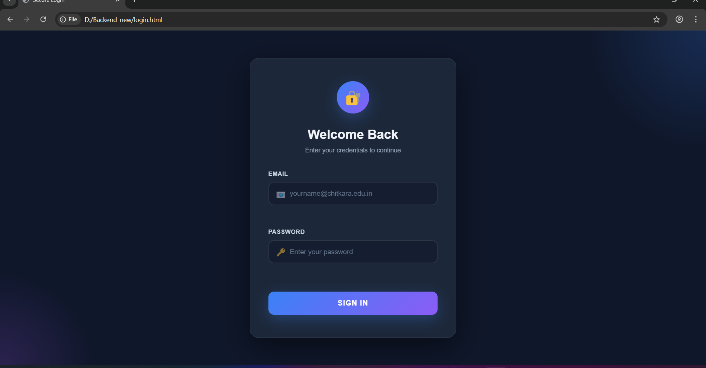
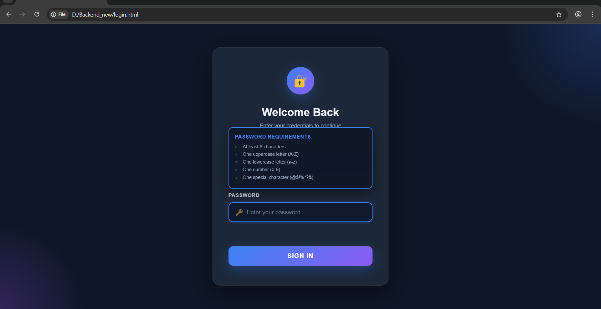
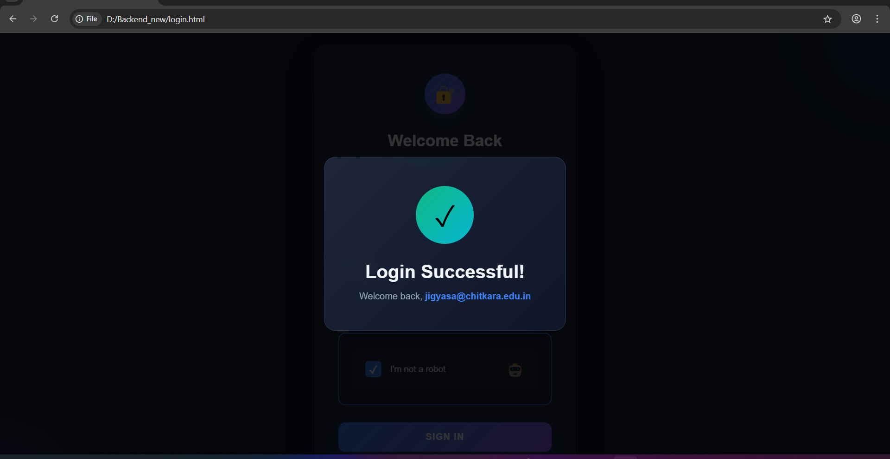

# 🔐 Secure Login UI

A modern, responsive login page with:

## ✨ Features
- Real-time email validation (@chitkara.edu.in only)
- Strong password checker with tooltip for requirements
- "I'm not a robot" verification checkbox
- Success modal animation on login
- Smooth animations: pulse, bounce, and slide-down effects
- Glassmorphism UI design
- Responsive layout for mobile and desktop

## 🚀 Live Demo
You can host this page on GitHub Pages to see it live:  
[Live Demo Link](https://jigyasabindal.github.io/secure-login-ui/login.html)

## 🖼 Screenshots
### Login Page


### Password Tooltip


### Success Modal


## 💻 How to Use
1. Clone the repo:

```bash
git clone https://github.com/jigyasabindal/secure-login-ui.git
